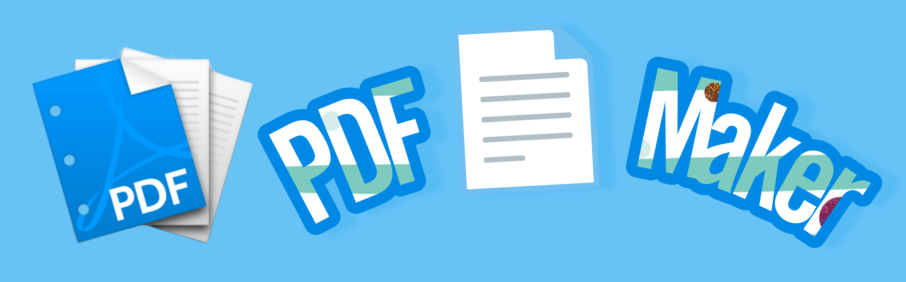

# PDF Maker 🇵🇸



**pdf_maker** is a simple yet powerful Flutter plugin that lets you design your pages and turn them into high-quality PDF documents without breaking fonts or compromising quality. Create professional-grade PDFs with any design, in any language, all at once. Enjoy easy real-time previews and total control over your layout.

[](https://pub.dev/packages/pdf_maker)


## ✨ Features

- **Design Freedom**: Create your page layout the way you want, with no restrictions.
- **High-Quality Output**: Preserve font integrity and image quality for crisp, clear PDFs.
- **Multipage Support**: Seamlessly combine multiple pages into a single PDF document.
- **Real-Time Preview**: Instantly preview your designs and make adjustments on the fly.
- **Flexible and Versatile**: Support for any language and any design style.
- **Lightweight and Fast**: Optimized for performance with minimal overhead.

## 🚀 Installation

Add `pdf_maker` to your `pubspec.yaml`:

```yaml
dependencies:
  pdf_maker: ^1.0.0
```

## 🛠️ Usage

### Quick Start

**How to Design Your Page?**

A concrete implementation of BlankPage.

```dart
class TestPage extends BlankPage {
  const TestPage({super.key});

  @override
  Widget createPageContent(BuildContext context) {
    return const Center(
      child: Text('Save Palestine 🇵🇸'),
    );
  }
}
```

Generate a PDF from your custom page design in just a few steps:

```dart
        ElevatedButton(
              onPressed: () async {
                PDFMaker maker = PDFMaker();
                maker.createPDF(
                  const TestPage(),
                  setup: PageSetup(
                      context: context,
                      quality: 4.0,
                      scale: 1.0,
                      pageFormat: PageFormat.a4,
                      margins: 40),
                    )
                    .then((file) {
                  saveAndOpen(file);
                });
              },
              child: const Text("Create PDF"),
          )
```

Or,
You can use BlankPage static function.

```dart
        ElevatedButton(
              onPressed: () async {
                try {
                  final pdfFile = await BlankPage.createPDF(
                    const TestPage(),
                    setup: PageSetup(context: context),
                  );
                  saveAndOpen(pdfFile);
                } catch (e) {
                  print("Error creating PDF: $e");
                }
              },
              child: const Text("Create PDF"),
            ),
```

## ✨ Simple as That!

You can now use the toPDF method on any instance of BlankPage (or its subclasses) to generate a PDF:


```dart
final pdfFile = await const TestPage().toPDF(
  setup: PageSetup(context: context),
);
```

## ⚠️ Caution: Handling Context

When using the `createPDF` method, it's important to manage the `BuildContext` properly.

- **If you do not pass the `BuildContext`**: You must hard-code text colors and other properties that would otherwise rely on context, as the absence of context means it can't dynamically get them.

- **If you choose to pass the `BuildContext`**: It can use it dynamically to access theme data, colors, and other context-dependent properties and **`It's recomended`**


## Demo Preview 📥

[Click here to check the generated invoice pdf file](example/demo/invoice.pdf)

[Click here to check a simple pdf letter with different languages](example/demo/letter.pdf)

## 📚 API Reference

### **BlankPage**

`BlankPage` is an abstract base class for creating custom page templates. Subclasses should implement the `createPageContent` method to define the specific content of each page.

- **Methods**:
  - **`createPageContent(BuildContext context)`**: 
    An abstract method that must be overridden to define the content of the page.

### **PageSetup**

`PageSetup` is a configuration class used to specify the properties for generating a PDF, such as page format, scaling, margins, and quality.

- **Properties**:
  - **`pageFormat`**: The format of the PDF page (e.g., A4, Letter).
  - **`scale`**: The scale factor for the content.
  - **`margins`**: The margins around the page content, specified in pixels.
  - **`quality`**: The quality level of the generated PDF.
  - **`context`**: An optional `BuildContext` for accessing theme data and other contextual information.


### **toPDF**
`toPDF` is an extension method for the `BlankPage` class that generates a PDF from the instance of the class.

- **Method**:
  - **`toPDF({PageSetup? setup})`**: 
    Converts the `BlankPage` instance to a PDF using the specified `PageSetup`.

  - **Returns**: A `Future<Uint8List>` containing the PDF file's bytes.

### **createPDF**

`createPDF` is a function that handles the PDF generation from a `BlankPage` instance.

- **Method**:
  - **`createPDF(BlankPage page, {PageSetup? setup})`**: 
    Generates a PDF from the specified `BlankPage` instance using the provided `PageSetup`.

  - **Returns**: A `Future<Uint8List>` with the bytes of the generated PDF.

## 🚀 Contributing 

I encourage contributions from developers who are passionate about improving this project. If you encounter bugs or have ideas for new features, feel free to make fixes or improvements and submit a Pull Request. Together, we can make this project even better! 💡"


## 📄 License

Licensed under the MIT License. See the LICENSE file for details.

## 👨‍💻 Author

PDF Maker is maintained by AR Rahman. You can contact me at [arrahman.bd@outlook.com](mailto:arrahman.bd@outlook.com).

If you find PDF Maker helpful, please ⭐️ the repository!

[](https://thebsd.github.io/StandWithPalestine)[](https://thebsd.github.io/StandWithPalestine)[](https://thebsd.github.io/StandWithPalestine)
